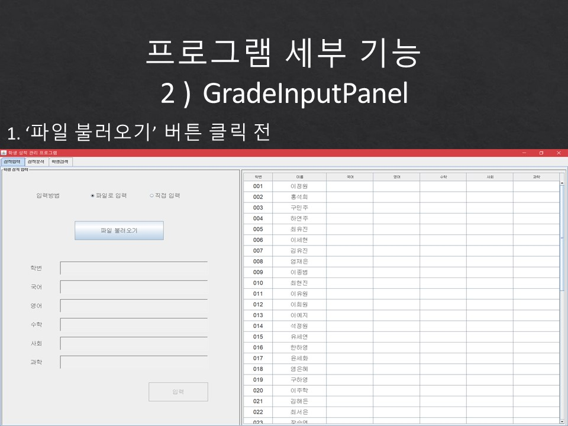

# Grade Program

###1. 프로젝트 소개

###2. 협업 방식

###3. 프로젝트 설계도 : 클래스다이어그램

###4. 프로젝트 세부 구조와 세부 기능
####1) 메인
* javax.swing.JTabbedPane 사용해서 '성적입력', '성적분석', '학생검색' 탭 구성

####2) 성적 입력 Tab

* 파일 읽어와서 JTable에 보여주는 기능

* 학생 성적 수정 기능

####3) 성적 분석 Tab

* 과목별 성적 JTable 보여주기
* 점수 범위 별 학생 인원 분포 막대그래프 그려주는 기능

* 학생의 평균점수 / 학점평균 JTable 보여주기
* 과목별 총학생 평균점수 막대그래프 그려주는 기능

* 학생 성적 파일 저장 기능

* JTable column 정렬 기능

* 정렬에 사용한 알고리즘 : 1. Quick Sort

* 정렬에 사용한 알고리즘 : 2. Comparable

* 크기 비교 후 column 교환

####4) 학생 검색 Tab

* StudentsDatabase 에서 학생 검색 기능

* 학생 정보와 성적JTable 보여주는 기능
* 검색한 학생의 성적비율(과목성적 / 총과목성적 * 100) Piechart 그려주는 기능

###5. 개발 시 유의한 부분 : 예외처리
####1) 성적 입력 Tab

####2) 학생 검색 Tab

###6. 개발 후, 아쉬웠던 점

++ OOP가 아닌 것 같다는 생각을 했다 ++

== 해결 방법 : 공유해야 되는 인스턴스를 메소드의 파라미터로 넘겨줬더라면? ==

